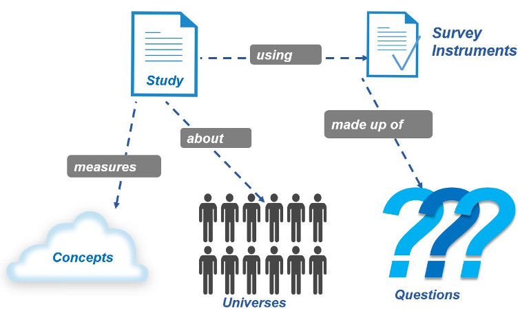
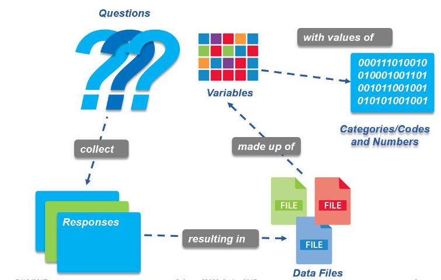

name: inverse
class: center, middle
layout: true

---

# Using Data in Research

.left[.footnote[__UCLA Library Data Archive__ 
1120-H Rolfe Hall 
ucla-data-archive@googlegroups.com 
310-825-0716 
[https://www.library.ucla.edu/social-science-data-archive](https://www.library.ucla.edu/social-science-data-archive)]]

???
slide notes  test
---
layout: false

## Today's Topics  

1. Social Science Data Archives
2. How to search for and find research data
3. Learn about sources for data
4. Data Management Plans

---

## Social Science Data Archives

* Available to all students
* Holdings include public opinion polls, census data, crime stats, political and social behavior, etc.
* Provide assistance in finding and using data
* List services

---

## Role of Data in Research

---

## Finding Out About Data Sources

* Colleagues
* Public media (newspapers, news)
* Social media (twitter, etc)
* Scholarly literature
* Government reports and documents
* Archives and project websites
* Codebooks, questionnaires
* Exploration of datasets

---

## Defining Your Research

---

## Defining Your Research

---

## Defining Your Research

---

## Questionnaires and Codebooks

### How do I know this study useful?  

---

## What is a Questionnaire?

* A __questionnaire__ is a _research_ instrument consisting of a series of _questions_ and other prompts for the purpose of gathering information from respondents.  
* Questionnaires cover separate topics such as:
	* Preferences (e.g. political party)
    * Behaviors (e.g. food consumption)
    * Facts (e.g. gender)
* Questionnaires can include indexes or scales:
	* Latent traits (e.g. personality traits)
    * Attitudes (e.g. towards immigration)
    * An index (e.g. Social Economic Status)

---

## Codebooks

---

## Codebooks

---

## ICPSR section

---

## Questions?  

