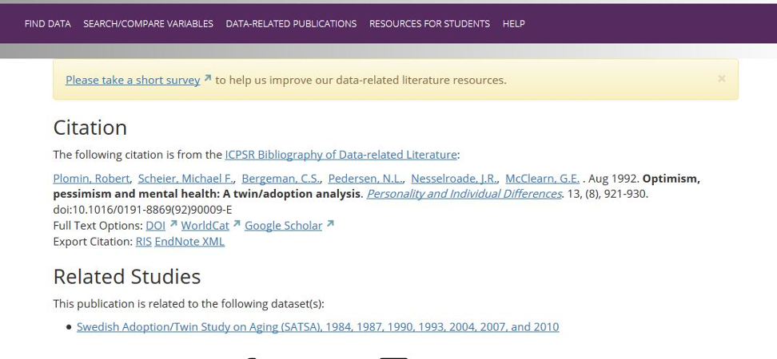

# Using Data in Research

.left[.footnote[__UCLA Library Data Archive__ 
1120-H Rolfe Hall 
ucla-data-archive@googlegroups.com 
310-825-0716 
[https://www.library.ucla.edu/social-science-data-archive](https://www.library.ucla.edu/social-science-data-archive)]]

.left[.footnote[Psych M144 / Stats M154   Fall 2017]]

???
slide notes  test
---
layout: false

## Today's Topics  

In this session you will:
* Learn about the role of data in your research
* How to search for and access data for research
* Learn about resources, tools and support available to students and researchers at UCLA
* Data Management Plans  

.left[.footnote[Psych M144/Stats M154 Fall 2017]]

???

---

## UCLA Library Data Archives
#### (formally the Social Science Data Archive)

* On the UCLA campus since 1961 [About the Data Archive](https://www.library.ucla.edu/social-science-data-archive/about-data-archive)
* Available to all UCLA faculty and students
* Holdings include public opinion polls, census data, crime stats, political and social behavior, etc.

[https://www.library.ucla.edu/location/social-science-data-archive](https://www.library.ucla.edu/location/social-science-data-archive)

.left[.footnote[Psych M144/Stats M154 Fall 2017]]

???
---
## Data Archive: Our services
* Reference: assist students to find and use data
* Data Management Plans
* Metadata
* Provide training: [Software/Library carpentry](https://software-carpentry.org/) / [Software Carpentry R-language](https://www.library.ucla.edu/events/software-carpentry-workshop-r-version)   

* Host events and lectures: [Data Archive News and Upcoming Events](https://www.library.ucla.edu/location/social-science-data-archive)

.left[.footnote[Psych M144/Stats M154 Fall 2017]]

???
---

## Role of Data in Research

.left[.footnote[Psych M144/Stats M154 Fall 2017]]

???
---

## Finding Out About Data Sources

* UCLA Library Data Archive
* Colleagues
* Public media (newspapers, news)
* Social media (twitter, etc)
* Scholarly literature
* Government reports and documents
* Archives and project websites
* Codebooks, questionnaires
* Exploration of datasets

.left[.footnote[Psych M144/Stats M154 Fall 2017]]

???
---

## Search Strategies and Defining Your Research

* General to specific; broad to narrow
* Names of investigators; names of studies
* Studies described in literature, news and websites  

.left[.footnote[Psych M144/Stats M154 Fall 2017]]

???
---

## How do I know this study useful?

#### Raw data are not eye-readable.  

  

#### To decipher data you will use:  Questionnaires and Codebooks

.left[.footnote[Psych M144/Stats M154 Fall 2017]]

???
---

## What is a Questionnaire?

* A __questionnaire__ is a _research_ instrument consisting of a series of _questions_ and other prompts for the purpose of gathering information from respondents.  
* Questionnaires cover separate topics such as:
	* Preferences (e.g. political party)
    * Behaviors (e.g. food consumption)
    * Facts (e.g. gender)
* Questionnaires can include indexes or scales:
	* Latent traits (e.g. personality traits)
    * Attitudes (e.g. towards immigration)
    * An index (e.g. Social Economic Status)

.left[.footnote[Psych M144/Stats M154 Fall 2017]]

???
---

## Codebooks
  

???
---

## Codebooks  
  

.left[.footnote[Psych M144/Stats M154 Fall 2017]]

???
---

## ICPSR Data Site  
#### Inter-university Consortium for Political and Social Research [http://www.icpsr.umich.edu](http://www.icpsr.umich.edu)  
  

???
---
## ICPSR: Find Data
[http://www.icpsr.umich.edu/icpsrweb/ICPSR](http://www.icpsr.umich.edu/icpsrweb/ICPSR)  
  

.left[.footnote[Psych M144/Stats M154 Fall 2017]]
???
---

## ICPSR: Register to Access Data

.left[.footnote[Psych M144/Stats M154 Fall 2017]]
???

---

## ICPSR: Search by Topics

.left[.footnote[Psych M144/Stats M154 Fall 2017]]

???

---

## ICPSR: Search for and Compare Variables

.left[.footnote[Psych M144/Stats M154 Fall 2017]]

???

---
## ICPSR: Compare Variables

.left[.footnote[Psych M144/Stats M154 Fall 2017]]

???

---

## ICPSR: Study Page and Data

.left[.footnote[Psych M144/Stats M154 Fall 2017]]

???

---

## ICPSR: Reading About Data

.left[.footnote[Psych M144/Stats M154 Fall 2017]]

???

---

## ICPSR: Publications linked to Data

.left[.footnote[Psych M144/Stats M154 Fall 2017]]

???

---

## ICPSR: Publications Linked to Data

.left[.footnote[Psych M144/Stats M154 Fall 2017]]

???

---

## Data Sources

* ICPSR: [http://www.icpsr.umich.edu/icpsrweb/ICPSR/](http://www.icpsr.umich.edu/icpsrweb/ICPSR/)
* UCLA Library Data Archive Catalog: [https://dataverse.harvard.edu/dataverse/ssda_ucla](https://dataverse.harvard.edu/dataverse/ssda_ucla)
* Government Sites, Census Data:   [https://www.census.gov/](https://www.census.gov/)
* IPUMS (Integrated Public Use Microdata Series): [https://www.ipums.org/](https://www.ipums.org/)
* Public Policy Institute of CA: [www.ppic.org](www.ppic.org)
* NBER (National Bureau of Economic Research): [http://www.nber.org/data/](http://www.nber.org/data/)
* CDC/NCHS (Centers for Disease Control and Prevention/National Center for Health Statistics): [https://www.cdc.gov/nchs/surveys.htm](https://www.cdc.gov/nchs/surveys.htm)
* Pew Research Center: [http://www.pewresearch.org/](http://www.pewresearch.org/)
* Data.gov: [https://www.data.gov/](https://www.data.gov/)

.left[.footnote[Psych M144/Stats M154 Fall 2017]]

???

NCHS:  <https://www.cdc.gov/nchs/nsfg/nsfg_2013_2015_puf.htm>
pew:  <http://www.pewforum.org/2015/05/12/americas-changing-religious-landscape/>
ipums:  <https://www.ipums.org/>
https://usa.ipums.org/usa/intro.shtml#uses  - define pums
https://usa.ipums.org/usa-action/faq#ques30
Los Angeles County Health Survey:   http://publichealth.lacounty.gov/ha/hasurveyintro.htm

---

# Data Management Plans

.left[.footnote[Psych M144/Stats M154 Fall 2017]]

---
## What is a Data Management Plan?

.left[.footnote[Psych M144/Stats M154 Fall 2017]]

---

## Questions?  

.left[.footnote[Psych M144/Stats M154 Fall 2017]]

???
---

## Problems ?

## The Data Archive is here to help
1120-H Rolfe 
ucla-data-archive@googlegroups.com 
310-825-0716 

.left[.footnote[Psych M144/Stats M154 Fall 2017]]
