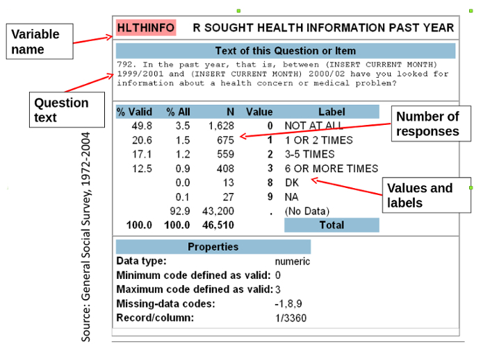
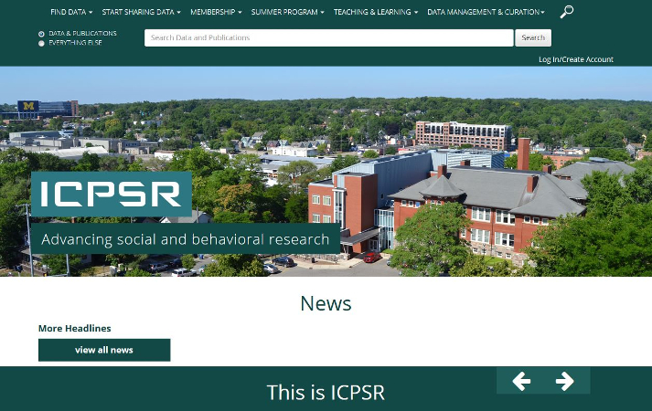
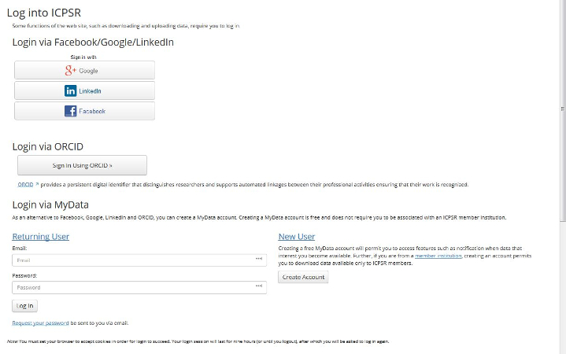
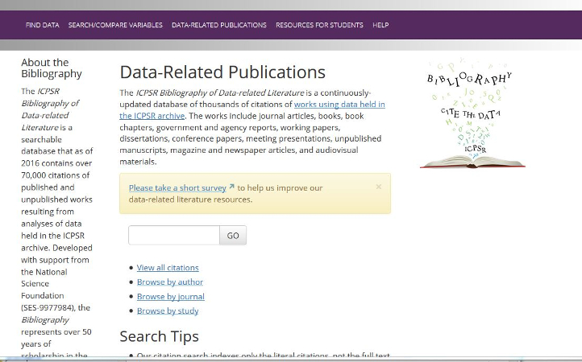

     

# Using Data in Research  
Library Data Archive
Fall Quarter 2017

.footnote[Psych M144/Stats M154     Fall 2017]
---

## Today's Topics    

* UCLA Library Data Archives
* The role of data in your research
* How to search for and acess data for research
* Resources, tools and support available to students at UCLA
* Publishing and Data Management Plans

.footnote[Psych M144/Stats M154     Fall 2017]
---

## UCLA Library Data Archives   
#### (formally the Social Science Data Archive)
* On the UCLA campus since 1961 [About the Data Archive](https://www.library.ucla.edu/social-science-data-archive/about-data-archive)
* Available to all UCLA faculty and students
* Holdings include public opinion polls, census data, crime stats, political and social behavior, etc.  

[https://www.library.ucla.edu/location/social-science-data-archive](https://www.library.ucla.edu/location/social-science-data-archive)
.footnote[Psych M144/Stats M154     Fall 2017]
---
## Data Archive: Our services
* Reference: assist students to find and use data
* Data Management Plans
* Metadata
* Provide training: [Software/Library carpentry](https://software-carpentry.org/) / [Software Carpentry R-language](https://www.library.ucla.edu/events/software-carpentry-workshop-r-version)   

* Host events and lectures: [Data Archive News and Upcoming Events](https://www.library.ucla.edu/location/social-science-data-archive)
.footnote[Psych M144/Stats M154     Fall 2017]
---

## Role of Data in Research

.footnote[Psych M144/Stats M154     Fall 2017]
---

## Finding Out About Data Sources

* UCLA Library Data Archive
* Colleagues
* Public media (newspapers, news)
* Social media (twitter, etc)
* Scholarly literature
* Government reports and documents
* Archives and project websites
* Codebooks, questionnaires
* Exploration of datasets

.footnote[Psych M144/Stats M154     Fall 2017]
---

## Search Strategies and Defining Your Research

* General to specific; broad to narrow
* Names of investigators; names of studies
* Studies described in literature, news and websites  

.footnote[Psych M144/Stats M154     Fall 2017]
---

## How do I know this study useful?

* Raw data are __not__ eye-readable
* To decipher data you will use __Questionnaires and Codebooks__

  
.footnote[Psych M144/Stats M154     Fall 2017]
---

## What is a Questionnaire?

* A __questionnaire__ is a _research instrument_ consisting of a series of _questions_ and other prompts for the purpose of gathering information from respondents.  

* Questionnaires cover separate topics such as:
	* Preferences (e.g. political party)
    * Behaviors (e.g. food consumption)
    * Facts (e.g. gender)

* Questionnaires can include indexes or scales:
	* Latent traits (e.g. personality traits)
    * Attitudes (e.g. towards immigration)
    * An index (e.g. Social Economic Status)

.footnote[Psych M144/Stats M154     Fall 2017]
---

## Questionnaire: ABC New Poll
  
.footnote[Psych M144/Stats M154     Fall 2017]
---
## What is a Codebook?

* An overview of the study or dataset
* Variable names and descriptions
* Column locations (mostly this is for raw data)

### May also include:
* Test of questions if the data comes from a survey
* Example of the Questionnaire
* Detail on who responded to the survey

.footnote[Psych M144/Stats M154     Fall 2017]
---

## Codebook: General Social Survey
  

.footnote[Psych M144/Stats M154     Fall 2017]
---

## Codebook and Raw Data
  

.footnote[Psych M144/Stats M154     Fall 2017]
---

## ICPSR Data Site  
#### Inter-university Consortium for Political and Social Research [http://www.icpsr.umich.edu](http://www.icpsr.umich.edu)  
  

.footnote[Psych M144/Stats M154     Fall 2017]
---
## ICPSR: Find Data
[http://www.icpsr.umich.edu/icpsrweb/ICPSR](http://www.icpsr.umich.edu/icpsrweb/ICPSR)  
  

.footnote[Psych M144/Stats M154     Fall 2017]
---

## ICPSR: Register to Access Data

.footnote[Psych M144/Stats M154     Fall 2017]
---

## ICPSR: Search by Topics

.footnote[Psych M144/Stats M154     Fall 2017]
---

## ICPSR: Search for and Compare Variables

.footnote[Psych M144/Stats M154     Fall 2017]
---

## ICPSR: Compare Variables

.footnote[Psych M144/Stats M154     Fall 2017]
---

## ICPSR: Study Page and Data

  

.footnote[Psych M144/Stats M154     Fall 2017]
---

## ICPSR: Reading About Data

.footnote[Psych M144/Stats M154     Fall 2017]
---

## ICPSR: Publications linked to Data

  

.footnote[Psych M144/Stats M154     Fall 2017]
---

## ICPSR: Publications Linked to Data

.footnote[Psych M144/Stats M154     Fall 2017]
---

## Data Sources

* ICPSR: [http://www.icpsr.umich.edu/icpsrweb/ICPSR/](http://www.icpsr.umich.edu/icpsrweb/ICPSR/)
* UCLA Library Data Archive Catalog: [https://dataverse.harvard.edu/dataverse/ssda_ucla](https://dataverse.harvard.edu/dataverse/ssda_ucla)
* Government Sites, Census Data:   [https://www.census.gov/](https://www.census.gov/)
* IPUMS (Integrated Public Use Microdata Series): [https://www.ipums.org/](https://www.ipums.org/)
* Public Policy Institute of CA: [www.ppic.org](www.ppic.org)
* NBER (National Bureau of Economic Research): [http://www.nber.org/data/](http://www.nber.org/data/)
* CDC/NCHS (Centers for Disease Control and Prevention/National Center for Health Statistics): [https://www.cdc.gov/nchs/surveys.htm](https://www.cdc.gov/nchs/surveys.htm)
* Pew Research Center: [http://www.pewresearch.org/](http://www.pewresearch.org/)
* Data.gov: [https://www.data.gov/](https://www.data.gov/)

.footnote[Psych M144/Stats M154     Fall 2017]
---

# Data Management Plans

* What is a Data Management Plans
* Why do I need this?
* What tools are available to help?

.footnote[Psych M144/Stats M154     Fall 2017]
---

## What is a Data Management Plan?

A data management plan is a document that describes what you will do with your data _during_ your research and _after_ you complete your research.

.footnote[Psych M144/Stats M154     Fall 2017]
---

## Why do you need this?

* Funding Agencies
* Publishing  [https://dataden.library.ucla.edu/jspui/](https://dataden.library.ucla.edu/jspui/)  ORCID:[https://orcid.org/](https://orcid.org/)
* Sharing and Archiving Data
* Regardless of the requirements, good data management is an essential skill for researchers.

.footnote[Psych M144/Stats M154     Fall 2017]
---

## Getting Help with Data Management Plans

* Data Archive
* ICPSR

.footnote[Psych M144/Stats M154     Fall 2017]
---

## Questions?  

.footnote[Psych M144/Stats M154     Fall 2017]
---

## Problems ?

## The Data Archive is here to help
1120-H Rolfe 
ucla-data-archive@googlegroups.com 
310-825-0716  
Tim Dennis, Director of the Data Archive 
Jamie Jamison, Archive Staff 

.footnote[Psych M144/Stats M154     Fall 2017]
